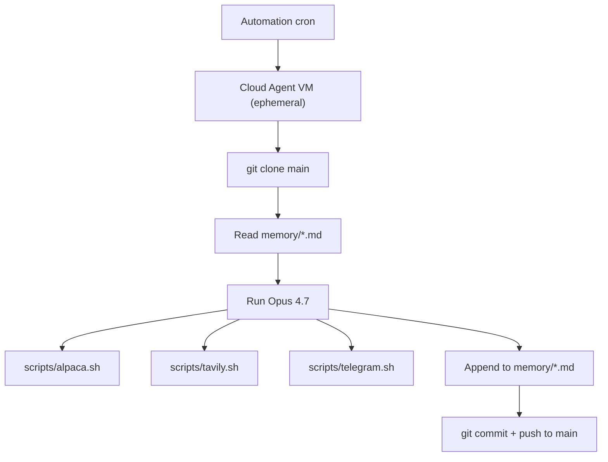

# Trading Bot — Cursor Automations Edition

Autonomous swing-trading bot that runs five times a weekday on **Cursor Automations** (Cloud Agents) using **Claude 4.7 Opus**. Adapted from Nate Herk's "Opus 4.7 Trading Bot — Setup Guide" (originally built on Claude Code cloud routines). The trading strategy, hard rules, wrappers, memory model, and prompt scaffold are unchanged; runtime/scheduler are Cursor instead of Claude Code, and notifications go to Telegram instead of ClickUp.

> Stocks only. No options, ever. The discipline is the strategy.

## How it works

Five Cursor Automations, each with its own cron, fire on weekdays. On each fire:

1. Cursor's Cloud Agent VM clones this repo at `main`.
2. It reads `memory/*.md` for context.
3. It runs the routine prompt with Claude 4.7 Opus.
4. The agent calls `scripts/alpaca.sh` / `tavily.sh` / `telegram.sh` as needed.
5. It appends to `memory/*.md`, then **commits and pushes to `main`**.
6. The VM is destroyed. No state survives outside git.



## The five workflows

| Routine | Cron (America/Chicago) | Purpose |
|---|---|---|
| `routines/pre-market.md` | `0 6 * * 1-5` | Research catalysts, write today's trade ideas |
| `routines/market-open.md` | `30 8 * * 1-5` | Execute planned trades, set 10% trailing stops |
| `routines/midday.md` | `0 12 * * 1-5` | Cut losers at -7%, tighten stops on winners |
| `routines/daily-summary.md` | `0 15 * * 1-5` | EOD snapshot to TRADE-LOG.md, Telegram recap |
| `routines/weekly-review.md` | `0 16 * * 5` | Friday: weekly stats + letter grade |

Adjust the timezone in each Automation to your locality.

## Repository layout

```
trading-bot/
├── AGENTS.md                # Auto-loaded rulebook (read every Cursor session)
├── README.md                # This file
├── env.template             # Documents required vars; .env is gitignored
├── .gitignore
├── .cursor/
│   └── environment.json     # Cloud Agent VM bootstrap (jq, python3, chmod)
├── routines/                # Source of truth for the 5 Automation prompts
│   ├── pre-market.md
│   ├── market-open.md
│   ├── midday.md
│   ├── daily-summary.md
│   └── weekly-review.md
├── scripts/                 # The only path to external APIs
│   ├── alpaca.sh
│   ├── tavily.sh
│   └── telegram.sh
└── memory/                  # Agent's persistent state (committed to main)
    ├── TRADING-STRATEGY.md
    ├── TRADE-LOG.md
    ├── RESEARCH-LOG.md
    ├── WEEKLY-REVIEW.md
    └── PROJECT-CONTEXT.md
```

## One-time setup (do these in order)

### 1. Push this repo to GitHub

Create a private repo and push `main`.

### 2. Install the Cursor GitHub App

Go to your Cursor dashboard → GitHub integration, install the **Cursor GitHub App** on this repo with **read + write** permissions. This is what lets Cloud Agents clone and push.

### 3. Add Secrets in the Cursor Cloud Agents dashboard

At [cursor.com/dashboard/cloud-agents](https://cursor.com/dashboard/cloud-agents) → Secrets, add each of these. Mark the API keys as **redacted** so the agent can't accidentally commit them:

| Name | Notes |
|---|---|
| `ALPACA_API_KEY` | from Alpaca dashboard |
| `ALPACA_SECRET_KEY` | from Alpaca dashboard |
| `ALPACA_ENDPOINT` | start with `https://paper-api.alpaca.markets/v2` |
| `ALPACA_DATA_ENDPOINT` | `https://data.alpaca.markets/v2` |
| `TAVILY_API_KEY` | from app.tavily.com (1000 free searches/month) |
| `TAVILY_SEARCH_DEPTH` | `basic` (cheaper) or `advanced` (deeper) — default `basic` |
| `TELEGRAM_BOT_TOKEN` | from @BotFather, format `1234567890:AAEhBP9...` |
| `TELEGRAM_CHAT_ID` | numeric — your user ID, group ID, or channel ID |

### 4. Create the five Automations

At [cursor.com/automations](https://cursor.com/automations), create one Automation per routine. For each:

- **Repository**: this repo, branch `main`
- **Model**: Claude 4.7 Opus (Cloud Agents always run Max Mode)
- **Trigger**: Scheduled, with the cron from the table above, in your timezone
- **Open pull request**: **OFF** — the agent must push directly to `main` so the next run reads fresh memory
- **Prompt**: paste the entire contents of the matching `routines/*.md` file

### 5. Smoke test

Trigger only the **pre-market** Automation manually ("Run now") and inspect the VM logs:

- Env-var preflight prints all six required vars as `set`
- `bash scripts/alpaca.sh account` returns valid JSON (paper account)
- `memory/RESEARCH-LOG.md` gains a dated entry
- VM ends with `git push origin main` succeeding

If green, enable the other four. Watch the first full week of commits closely.

### 6. Going live

Once you've run a few days on paper successfully, swap `ALPACA_ENDPOINT` to `https://api.alpaca.markets/v2` in the Secrets dashboard. **No code changes needed.**

## Cost expectation

Cloud Agents always run Max Mode → Opus 4.7 at API rates ($5/M in, $25/M out). Rough estimate ~$0.50/run × ~109 runs/mo ≈ **$50–100/mo**. **Pro Plus** ($60/mo, $70 API included) is the natural fit; Ultra ($200/mo, $400 included) buys headroom.

## The trading strategy at a glance

- **Stocks only**, never options.
- Max 5–6 open positions, max 20% per position, target 75–85% deployed.
- Max 3 new trades per week.
- Every position gets a 10% trailing stop as a real GTC order.
- Cut any losing position at -7% from entry, manually.
- Tighten trail to 7% at +15% gain, to 5% at +20%.
- Never tighten within 3% of current price. Never move a stop down.
- Exit a sector after 2 consecutive failed trades.
- Patience > activity.

Full rulebook in `memory/TRADING-STRATEGY.md`.

## Safety notes

- The agent has full write access to your Alpaca account. **Run on paper for at least a week** before flipping to live.
- The wrapper scripts are the **only** path to external APIs. Never let the agent `curl` directly.
- Memory commits are append-only and dated. Rollback is `git revert`. Audit is `git log`.
